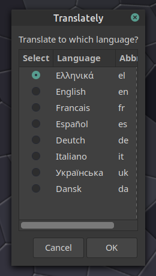

# Translately

A bash script that will translate .txt or .md to any language, **while keeping the original formatting**.

 It uses the **Translate Shell** command-line translator (https://www.soimort.org/translate-shell/).
 
## INSTRUCTIONS

  * Change directory to translately:
  
    cd  translately

  * Make  translately.sh executable:
  
      chmod +x translately.sh 

## DEPENDENCIES

<u>Install trans from git:</u>

    $ git clone https://github.com/soimort/translate-shell

    $ cd translate-shell/

    $ make

    $ [sudo] make install

## RUN

    ~/translately/translately.sh

